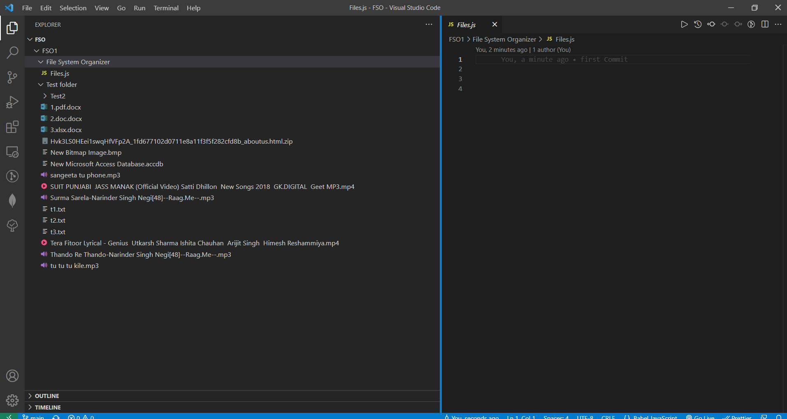
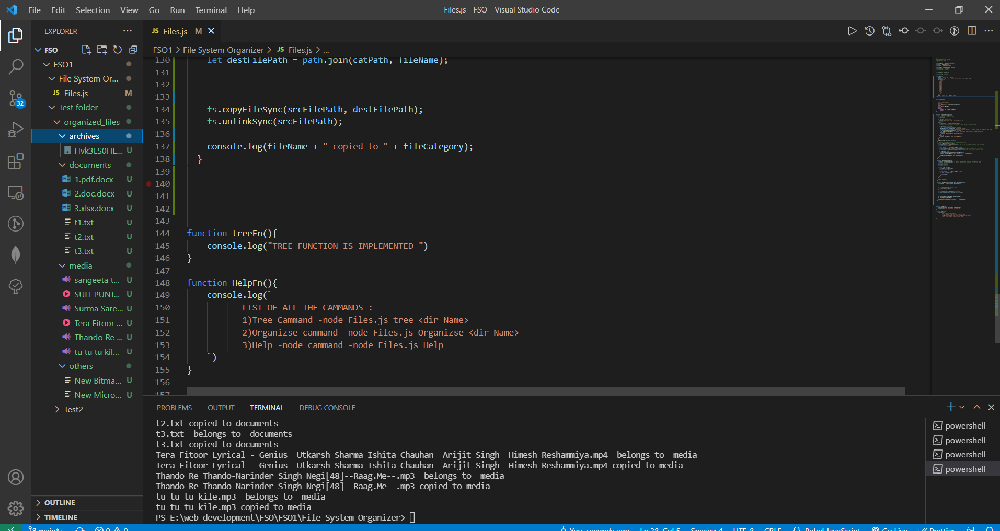

<h1 align="center">File System Organizer 💥</h1>

**[ File System Organizer 👉](https://github.com/mukeshdani/File-System-Organizer)** *Using Basic JavaScript and node modules*

## Technology 👇
-JavaScript 

-Node.js

-Git Hub 
 ## Platform 👇

-[Pepcoding](https://www.pepcoding.com/)

-[Nados](https://nados.pepcoding.com/)

-[Leetcode](https://leetcode.com/)

-[Visual Studio code editor](https://code.visualstudio.com/)

### contact 
💼 Pull requests help you collaborate on code with me [issues and pull requests](https://github.com/mukeshdani/File-System-Organizer/pulls) :)

 💼 if you have any doubt? do reach, [email](mailto:mukeshdani00@gmail.com) :)

# Before  Organize the file

# After Organize the file

# After using Tree cammand 

